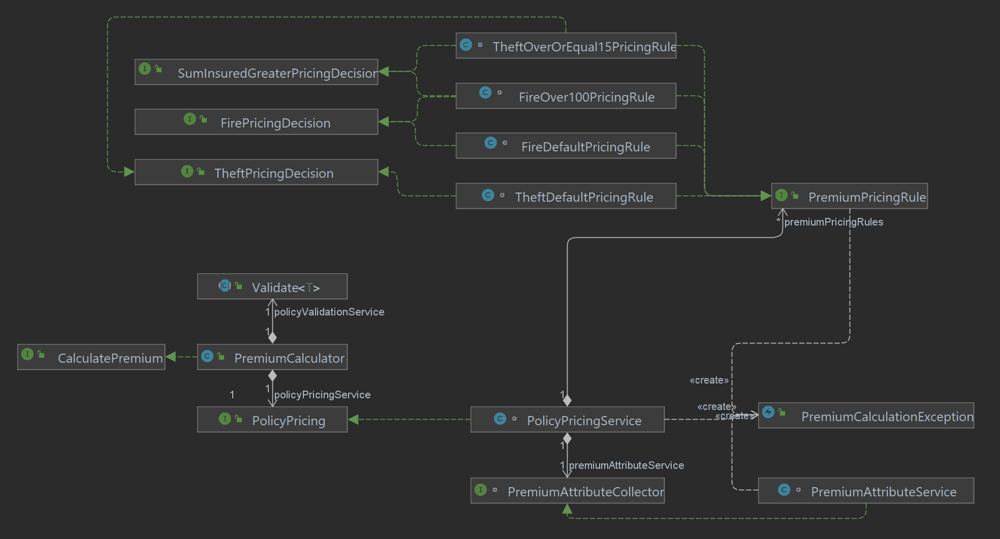
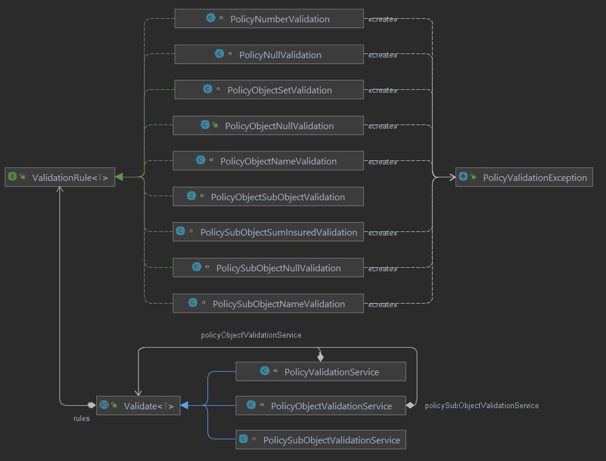

# Implementation notes
**PremiumCalculator** implements interface **CalculatePremium**.
Application is split in two parts Premium calculation and Policy Validation

## Application specific entities
### Premium
Contains premium amount and implements premium amount validation logic.
### PremiumAttribute
Contains aggregated data for premium calculation logic (Which coefficient to use).

## Policy Pricing
Policy pricing is split int two parts. **PremiumAttribte** aggregation and pricing.
### PremiumAttribute aggregation
**PremiumAttributeService** is used to gather all **PolicySubObjects** and do aggregation. Result is collection of **PremiumAttribute**s
that is used for Premium calculation. In case when **PremiumAttribute** collection is empty<sup>*</sup> exception is thrown.

<sub>As per definition, there can exist **PolicyObject**s without assigned **PolicySubObject**s, which should be treated
(according to answers provided) as if nothing is insured. In case when policy contains only **PolicyObyest** that do not have any **PolicySubObjects** we have "empty" policy and no meaningful calculation is possible. In this case exception is thrown.</sub>

### Pricing
**PremiumAttribute** is used to callculate premium amount in **PolicyPricingService**
Pricing logic is implemented in package **lv/pi/premiums/application/service/pricing**.
Pricing is done by choosing the correct pricing coefficient provided by the matching pricing rule. The pricing rule implements the interface
**PremiumPricingRule** and any decision interfaces that contain default methods for checking for specific risk types like **isFire** and
sumInsured amount range. Pricing rules are marked with annotations **@Component** and **@Order** as rule evaluation order matters.

**PolicyPricingService** handles pricing rules. It contains a collection of orderd pricing rules. Spring injects pricing rules in collection which imlpement **PremiumPricingRule** interface.
**PricingAttribute**s are passed to a service that evaluates rules one by one and uses the first matching rule to retrieve the coefficient
for specific **PolicyAttribute**. A coefficient is used to calculate an amount for specific **PolicyAttribute**. If multiple
**PolicyAttribute**s were provided to **PolicyPricingService** calculated amounts are summed. The total amount is returned to **PremiumCalculator** where **FinancialRoundingService** is used to round the value to configured scale.

If no matching rule is found, **PremiumCalculationException** is thrown.

### Pricing implementation diagram


## Policy Validation
As the application does not control **Policy** creation, it should do Policy validation.

Policy basic validation includes required fields and is done by _Lombok_ **@NonNull** annotation. Also, the assumption is made that
object collections all are **Set**'s to enforce the uniqueness of entries. Fields "Risk type" and "Policy status" value (e.g., FIRE, THEFT)
enforcement was done by implementing those fields as enums.

Advanced validation logic is implemented in package **lv/pi/premiums/application/service/validation**. Idea behind
implementation is that it is possible to define a validation rule that can be implemented on any entity.

Validation rule implements **ValidationRule** parametrized interface that defines method **validate** that implements validation
logic on entity. Rule implementation is annotated with spring annotation **@Component**. **@Order** annotation
should be used if rule evaluation order matters. In the current implementation, **@Order** is used to ensure null validation happens first. **PolicyValidationException** can be used if the validation does not pass.

Entity-specific validation services are created that extend parametrized abstract class **Validate** that contains
a collection of entity-specific rules. Validation rule collection is populated by spring injecting components that implement
interface **ValidationRule**. All specific entity rules are evaluated during validation.

### Validation implementation diagram


## Application specific entity validation
As application controls creation of entities **Premium** and **PremiumAttribute**, validation is done on entity creation.

## Adding new risk type
1. Add a new constant to **RiskType** with a new risk type name.
2. Create a new pricing rule class that implements the **PremiumPricingRule** interface.
    1. It is preferred to create a new interface that will implement the default method for identifying new risk type. e.g., FirePricingDecision.

## Example run in **PremiumsApplication**
```java
@SpringBootApplication
@Slf4j
public class PremiumsApplication {

    public static void main(String[] args) {
        ApplicationContext applicationContext = SpringApplication.run(PremiumsApplication.class, args);

        CalculatePremium premiumCalculator = applicationContext.getBean(CalculatePremium.class);

        Policy policy =
                new Policy("LV20-02-100000-5", PolicyStatus.REGISTERED, Set.of(
                        new PolicyObject("po-1",
                                Set.of(new PolicySubObject("pso-1", new BigDecimal("500"), RiskType.FIRE),
                                        new PolicySubObject("pso-2", new BigDecimal("102.51"), RiskType.THEFT)
                                )
                        )));

        log.info("Rez: " + premiumCalculator.calculate(policy).getAmount());
    }
}
```

## Prerequisites
* JDK 11
* Project uses Lombok, so enable annotation processing in your IDE